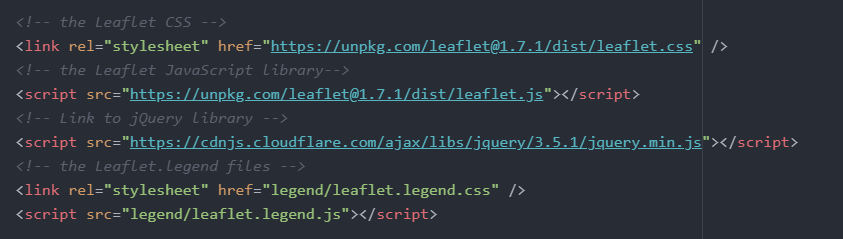

# Lab 3: Styling data on interactive maps

In Lab 2, you learned two different ways of adding data to a Leaflet map and learned how to make a data layer interactive with clickable popups. In this lab, we'll build on those skills to learn different ways to style vector data layers and more effectively present interactive thematic maps.

In the process, you'll gain practice with two important <u>techniques</u>:

* styling data layers based on attribute data
* building a legend with Leaflet

And you will also gain greater familiarity with the following <u>concepts</u>:

* JavaScript conditional statements
* Leaflet plugins 

### Section 1: Setup

Your starting files for this lab will be the final files you produced in Lab 2. Copy those files into a new folder for Lab 3. These should include an index.html file and data that represents global fault lines. It's a great idea to set up a new repository for your files on GitHub now; you'll eventually have to do this anyway, and setting up the repository now ensures you have a backup of your files in case anything goes wrong with the computer you're working on. Plus, it can make it easier to work between multiple machines if you use different computers on campus and at home.

Take a moment to refamiliarize yourself with the code you wrote last week. Read any comments you wrote to yourself to help you figure out what each section does. At minimum, identify the parts of the code where you:

* initialize the map
* add the basemap tiles
* add the earthquakes point layer
* add the fault lines line layer

### Section 2: Data-driven styling with proportional symbols

By default, the earthquake points on the map are styled with generic blue markers. This is fine, but what if we wanted to style the markers based on some attribute, such as magnitude? We can use JavaScript to make a proportional symbol map using conditional statements.

First, let's change our markers to circle markers. In the line of code where you create the markers for the earthquake layer, change `var marker = L.marker(latlng)` to the following. Note: JavaScript is case sensitive, so make sure you capitalize correctly!

```javascript
var marker = L.circleMarker(latlng);
```

Now, instead of creating markers, you are creating *circle* markers. Save and preview the change. By default, these are styled as blue circles with a radius of 10 pixels, and a partly transparent fill. We can change these style defaults with options that are specified within the `L.circleMarker()` method. Make the following change and view the results:

```javascript
var marker = L.circleMarker(latlng, {radius: 2, color: 'black'});
```

Here we've made the radius just 2px across and changed the color of the circle to black. Next, let's set the radius of the circle to change based on the magnitude of the earthquake. Make the following change to your code:

```javascript
var marker = L.circleMarker(latlng, {radius: feature.properties.mag, color: 'black'});
```

Here we're pulling our radius value from the magnitude property of the GeoJSON. At the time of my writing this tutorial, there had been a lot of small earthquakes in North America and a smaller number of larger earthquakes in the Pacific and Indian Oceans. What do the patterns look like on the day you're mapping the data?

Currently, the data is not classified, as is typical with proportional symbol maps of numeric data. That is, rather than being divided into classes (or 'buckets' as we sometimes call these), the radii of the circle markers are determined by values on an open range of values anywhere on the [Richter magnitude scale](https://en.wikipedia.org/wiki/Richter_magnitude_scale). But what if we were working with ordered categorical data? Let's say we wanted to put the quakes into four categories or buckets: tiny (quakes under mag 1), small (quakes between mag 1 and 2.5), medium (between mag 2.5 and 4.5), and large (quakes larger than mag 4.5). We can achieve this with a JavaScript conditional statement, also known as an if/else statement.

Conceptually we want to achieve the following:

```
If the earthquake has a magnitude greater than 4.5, represent the earthquake with a circle of radius 10px.

Else, if the earthquake has a magnitude between 4.5 and 2.5, represent it with a circle of radius 6px.

Else, if the earthquake has a magnitude between 2.5 and 1, represent it with a circle of radius 4px.

Else (if the earthquake has magnitude less than 1), represent it with a circle of radius 2px.
```

How do we write that in JavaScript code? With the following:

```javascript
$.getJSON("https://earthquake.usgs.gov/earthquakes/feed/v1.0/summary/all_day.geojson",function(data){
	// add GeoJSON layer to the map once the file is loaded
		L.geoJson(data, {
			pointToLayer: function(feature, latlng){
              			var radiusSize;
				var mag = feature.properties.mag;
	                		if (mag > 4.5) radiusSize = 10;
					else if ( mag > 2.5) radiusSize = 6;
	                		else if (mag > 1) radiusSize = 4;
					else radiusSize = 2;
			    	var marker = L.circleMarker(latlng, {radius: radiusSize, color: 'black'});
				marker.bindPopup("Location: " + feature.properties.place + "<br>Magnitude: " + feature.properties.mag + "<br><a href =" + feature.properties.url +">More info</a>");
				return marker;
			}
		}).addTo(mymap);
});
```

Make the above changes to your code, save your work, and view the changes in your web browser (note that your circles should be black rather than red):

<iframe src="https://ejslgr.github.io/Leaflet-Intro/code-samples/earthquakes-ex4.html" style="width:100%; height:500px;"></iframe> [View this example on its own](https://ejslgr.github.io/Leaflet-Intro/code-samples/earthquakes-ex4.html)

Go back to the code you just added and note a couple of things about it. First, notice that we created a variable called 'radiusSize,' which we then used a few times in the if/else statement and used in the style options (the code that goes inside the {curly brackets} in the line of code where we create the circle markers). We create this variable as an empty placeholder, then we give it a value (the number that comes after the = sign) based on the if/else statement. We then are able to use the variable *and the value we assigned it with the conditional statement* in the styling options. This is a very common use of variables: to create an empty placeholder that we can fill with data based on some additional code like a conditional statement.

Notice also that we created a variable called 'mag,' which we reference in the if/else statement. This wasn't necessary, but it saved us some time as it meant we could write `if (mag < 4.5)` in each statement instead of `if (feature.properties.mag < 4.5)`. This is another common use of variables: to save ourselves from having to write the same longer piece of code over and over again.

### Section 3: data-driven styling based on categorical string values

In the above, we styled our data based on a *numerical* property, but we can also style data based on string (or text) properties. Let's see how with the fault lines data.

First, open up the faultLines.geojson file that you downloaded from Canvas for Lab 2 (I recommend looking at the original GeoJSON file, not the JS file you created from the GeoJSON). If you are having trouble reading the file as it is formatted in Atom, try one of the two browser-based options we discussed in class (JSON Viewer extension in Chrome, or geojson.io).

Notice that one of the properties is 'slip_type'. This property represents the fault type, [a way of classifying fault lines](https://www.usgs.gov/faqs/what-fault-and-what-are-different-types) based on the angle of the fault and the direction of the slip. The main fault types are normal, reverse, left-lateral strike-slip (or what this data calls sinistral), and right-lateral strike-slip (or what this data calls dextral). There are some additional types, as well as some combinations of these four categories, and, some of the features in our dataset have no fault type specified, so we'll have to consider that in our visualization as well. Looking closely at the metadata provided from GEM, we can find that all of the following are possible values for the 'slip-type' property:

* Normal
* Normal-Dextral
* Normal-Sinistral
* Normal-Strike-Slip
* Reverse
* Reverse-Dextral
* Reverse-Sinistral
* Reverse-Strike-Slip
* Sinistral
* Sinistral Transform
* Sinistral-Normal
* Sinistral-Reverse
* Dextral
* Dextral Transform
* Dextral-Normal
* Dextral-Oblique
* Dextral-Reverse
* Anticline
* Blind Thrust
* Spreading Ridge
* Strike-Slip
* Subduction Thrust
* Syncline
* null [no value given]

Thus, conceptually, if we want to visualize these different categories with different colors, we'll want to represent our data something like the following:

```
If the fault type is normal (or a subtype of normal), represent the fault with Color 1.

If the fault type is reverse (or a subtype of reverse), represent the fault with Color 2.

If the fault type is sinistral (or a subtype of sinistral), represent the fault with Color 3.

If the fault type is dextral (or a subtype of dextral), represent the fault with Color 4.

If the fault type is something other than these categories, represent the fault with Color 5.

If there is no fault type specified, represent the fault with Color 6.
```

How do we translate that to code? First, let's create a list of all the possible values and specify what a color for each fault type category. By the way, I selected these colors using [ColorBrewer](https://colorbrewer2.org/#type=qualitative&scheme=Set1&n=5), but you are welcome to pick other colors if you choose. This list is what we would call an **object** in JavaScript: it is an array that stores `'key': 'value'` pairs. We use the variable with name `faultColors` to store the information in the object so we can reference it easily later in the code.

```javascript
        // fault types and color specs
        var faultColors = {
            //normal and subtypes (red)
            'Normal': "#e41a1c",
            'Normal-Dextral': "#e41a1c",
            'Normal-Sinistral': "#e41a1c",
            'Normal-Strike-Slip': "#e41a1c",
            //reverse and subtypes (blue)
            'Reverse': "#377eb8",
            'Reverse-Dextral': "#377eb8",
            'Reverse-Sinistral': "#377eb8",
            'Reverse-Strike-Slip': "#377eb8",
            //sinistral and subtypes (green)
            'Sinistral': "#4daf4a",
            'Sinistral Transform': "#4daf4a",
            'Sinistral-Normal': "#4daf4a",
            'Sinistral-Reverse': "#4daf4a",
            //dextral and subtypes (purple)
            'Dextral': "#984ea3",
            'Dextral Transform': "#984ea3",
            'Dextral-Normal': "#984ea3",
            'Dextral-Oblique': "#984ea3",
            'Dextral-Reverse': "#984ea3",
            //other fault types (orange)
            'Anticline': '#ff7f00',
            'Blind Thrust': "#ff7f00",
            'Spreading Ridge': "#ff7f00",
            'Strike-Slip': "#ff7f00",
            'Subduction Thrust': "#ff7f00",
            'Syncline': "#ff7f00",
        };
```

Copy and paste the faultColors object (above) into your code, just above the section of code where you add the fault line data to the map.

Next, change the section of the code where you add the fault line data to the map as a layer to add some styling options:

```javascript
		L.geoJson(faults, {
			interactive: false,
			style: function(feature) {
				if (feature.properties.slip_type != null){
					return {"color": faultColors[feature.properties.slip_type]};
				} 
				else {
					return {"color": "grey"};
				}
			}
		}).addTo(mymap);
```

The code we just added does two main things. Let's take this code apart line by line to understand what it does.

* ```if (feature.properties.slip_type != null)``` checks to see if the `slip_type` property for a given feature is null.
* If it is not null (remember from lecture that `!=` is the Javascript way of saying 'is not equal to'), then the code goes to the next line, `return {"color": faultColors[feature.properties.slip_type}`. This line of code uses the 'faultColors' object to set the color property of each feature.
* Finally, `else { return {"color": "grey"}; }` makes it so that if there is no value specified in the slip_type property--or if there is no match between the specified value (i.e. there is a typo in the data) and the possible values listed in `faultColors`--the fault line will still appear, but in the color grey.

Any questions? If anything is unclear, take a moment to make a note to ask about it in class next week!

### Section 4: Adding a legend

Now that our symbology is a bit more complex than just markers and lines, it's necessary to include a legend to help your audience interpret the map. Somewhat counter-intuitively, adding a legend is not particularly easy with Leaflet. But thankfully, a Leaflet user has developed a plugin that makes this much simpler. Plugins are basically small JavaScript libraries that are designed to increase the functionality of Leaflet. They are generally made and maintained by volunteers so they can vary in quality, but they also have the advantage of being available on-demand. That is, as map developers, we can pick and choose which plugins we want to add to a given map, which speeds up load times for the user instead of them having to download the code for all features, regardless of whether the map uses that feature or not.  

The plugin we are going to use is called Leaflet.Legend, developed by [JJ Jin](https://github.com/ptma). You can find [the documentation here](https://github.com/ptma/Leaflet.Legend) and see a [live demo here](https://ptma.github.io/Leaflet.Legend/examples/legend.html). As far as I can tell, this plugin is not available via CDN, so we will download the files and host them ourselves with the rest of our site files. 

From the documentation link above, click the green 'Code' button and select 'Download ZIP.' I suggest saving the ZIP file in your Downloads folder, then unzipping the files and moving just the files you need into your Lab 3 folder. The files you need are stored inside the 'src' folder. They are the leaflet.legend.css file and the leaflet.legend.js file. After unzipping, move just these two files into your Lab 3 folder, perhaps putting them inside an enclosing folder to keep your files organized. 

In the `<head>` of your index.html file, add links to these files just as you added links to the main Leaflet library. This time, however, you will use relative pathnames as your src values. Keep the links in the head of your file organized with comments. Mine, for instance, look like this: 

 

As you can see, I saved my leaflet.legend CSS and JS files inside of a folder called 'legend.' You do not need to do the same, but do make sure that your link goes to the correct location of the files. Otherwise, you'll get errors soon. 

Next up, we'll use some JavaScript to add two legend to the map. Copy the following code into the bottom of the JS section of your file, after the section that adds the fault lines to your map and before the closing `</script>` tag:

```javascript
//Fault line legend
		var Legend1 = L.control.Legend({
		    position: "bottomright",
			title: "Fault Types",
		    legends: [
					{
						label: "Normal",
		        		type: "polyline",
		        		color: "#e41a1c",
						weight: 4
		    		},
					{
						label: "Reverse",
						type: "polyline",
						color: "#377eb8",
						weight: 4
					}
			]
		}).addTo(mymap);

//Earthquake legend
		var Legend2 = L.control.Legend({
				position: "bottomleft",
				title: "Earthquake Magnitude",
				legends: [
					{
					 	label: "Less than 1",
						type: "circle",
						radius: 2,
						color: "black",
						fill: true,
						fillOpacity: "0.4"
					},
					{
						label: "Between 1 and 2.5",
						type: "circle",
						radius: 4,
						color: "black",
						fill: true,
						fillOpacity: "0.4"
					}
			]
		}).addTo(mymap);
```

Notice a couple of things about this code. First, we are using a method from the Leaflet.Legend library to extend the functionality of Leaflet itself. What is this method? (See the bottom of these instructions for the answer.)

`position`, `title`, and `legends` are all options built into this method in the Leaflet.Legend library. Take a moment to look over [the plugin documentation](https://github.com/ptma/Leaflet.Legend#leafletlegend) again. Another option available is `opacity`. On your own and using this documentation, modify your code to set the opacity of the legend containers to 0.6 so that they are partially transparent. 

Most of the legend content is written in the option called `Legends`. The value of this option is an array of different legend items. For each legend item, you set a label and use different options built into the library to recreate the symbol you are trying to represent. In the documentation, all of the options available to use for each legend item are listed under the LegendSymbol header. Self-check question: What are the possible values for the `type` option? 

Notice that both legends only provide symbols and labels for two of the legend items that need to be included for these layers. On your own, add additional code (copy and paste is your friend here) to add the remaining agenda items to each legend. In total, the Earthquake Magnitude legend should have 4 legend items, and the Fault Types legend should have 6 legend items. Tip: find the radius values for the circles and the color values for the fault lines in earlier parts of your code. 

Save and preview your changes very frequently to help you catch mistakes early! 

### Submission

Make any tweaks you wish to make to the design of your map and webpage. This is optional, but could include things like customizing fonts or the background color, choosing different basemap tiles for your map, or using CSS and/or the options built into Leaflet.Legend to adjust the positioning of your legends. 

**Bonus point ideas**

I will award bonus points on a case-by-case basis for exceptional design or functionality that enhances the map. For bonus points on this lab, consider completing one of the following optional challenges:

* Figure out how to use the `layers` option of LegendSymbols that is built into Leaflet.Layers library to make it possible to toggle the Fault Lines layer on and off
* This one is fairly ambitious, but try to use map panes to display the basemap labels over top of the vector data layers, following the steps in this tutorial: https://leafletjs.com/examples/map-panes/ (note, you will need to find a basemap and labels that are available separate from one another).

Upload your final files to a repository on GitHub, activate Pages for that repository, and submit on Canvas the URL to where I can find the live version of your map. 

### Self-check answers

* What is the method from Leaflet.legend that we use? *Answer: L.control.legend*
* What are the possible values for the `type` option? *Answer: image, circle, rectangle, polygon, or polyline. Extra note: if you use type 'image', you must specify the location of the image to display, using the `url` option.*
* (Not included in the text previously): visit [the GitHub profile of JJ Jin](https://github.com/ptma), the developer of Leaflet.Legend. What is another one of the Leaflet plugins they have developed, and what does it do? 
